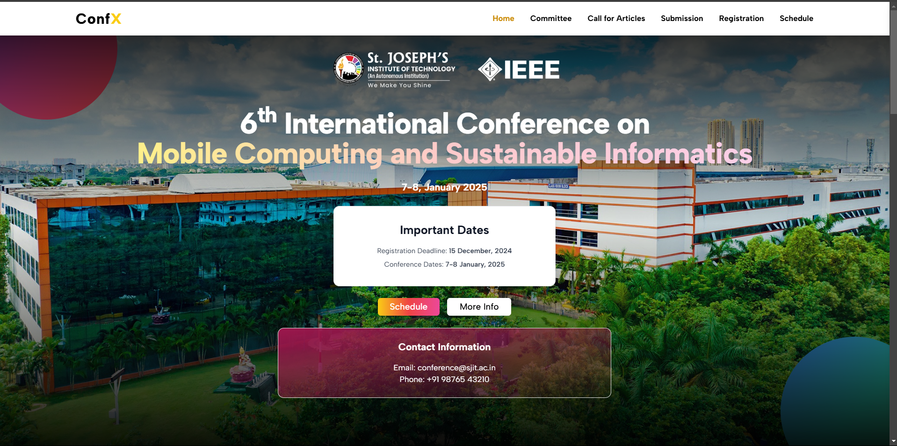

# 🌟 **Conference 2025 Official Website**  

🎉 **Welcome!** This repository hosts the official website for the **6th International Conference on Mobile Computing and Sustainable Informatics**, designed to provide participants with all the information they need about the event.  

---

## 🔥 **Features**  

✨ **Modern Design:** A sleek, professional, and visually appealing website.  
📄 **Dynamic Pages:**  
   - **Home:** Overview of the conference.  
   - **Committee:** Details about organizing members.  
   - **Call for Articles:** Information on submission guidelines.  
   - **Registration:** Seamless registration process.  
   - **Schedule:** Comprehensive event itinerary.  

📱 **Responsive Design:** Optimized for devices of all sizes – desktop, tablet, and mobile.  
🔗 **Quick Links:** Direct access to key sections of the website.  
📞 **Contact Information:** Easily reach out for queries.  
📱 **Social Media Integration:** Stay connected via Facebook, Twitter, Instagram, and LinkedIn.  

---

## 🚀 **Tech Stack**  

💻 **React**: For a modular and dynamic frontend.  
⚡ **Vite**: Lightning-fast build tool for optimized development.  
🎨 **Tailwind CSS**: For elegant and responsive designs.  
🌐 **React Icons**: Seamlessly integrated icons for better UX.  

---

## 🌐 **Live Demo**  

👉 **Check out the live website**: [Conference 2025 Website](https://conference2025.org)  

---

## 🛠️ **Installation**  

Follow these steps to set up the project locally:  

1. **Clone the Repository**:  
   ```bash  
   git clone https://github.com/johnwesley755/conference-website.git  
   cd conference-website  
   ```  

2. **Install Dependencies**:  
   ```bash  
   npm install  
   ```  

3. **Run the Development Server**:  
   ```bash  
   npm run dev  
   ```  

4. **Build for Production**:  
   ```bash  
   npm run build  
   ```  

---

## 📸 **Screenshots**  

### 🌟 Home Page:  
  

### 📋 Schedule Page:  
  

---

## 🤝 **Contributing**  

We ❤️ contributions!  

1. **Fork this repository**.  
2. **Create a branch** for your feature or fix:  
   ```bash  
   git checkout -b feature/amazing-feature  
   ```  
3. **Commit your changes**:  
   ```bash  
   git commit -m "Add amazing feature"  
   ```  
4. **Push to the branch**:  
   ```bash  
   git push origin feature/amazing-feature  
   ```  
5. **Open a pull request**.  

---

## 📬 **Contact**  

📧 **Email**: [contact@conference2025.org](mailto:contact@conference2025.org)  
🌐 **Website**: [Conference 2025 Official Site](https://conference2025.org)  
👨‍💻 **Designer & Developer**: [John Wesley](https://linkedin.com/in/john-wesley-6707ab258)  

---

## ⭐ **Support Us**  

If you find this project helpful, please consider giving it a **star** ⭐ and sharing it with others in your network!  

---
